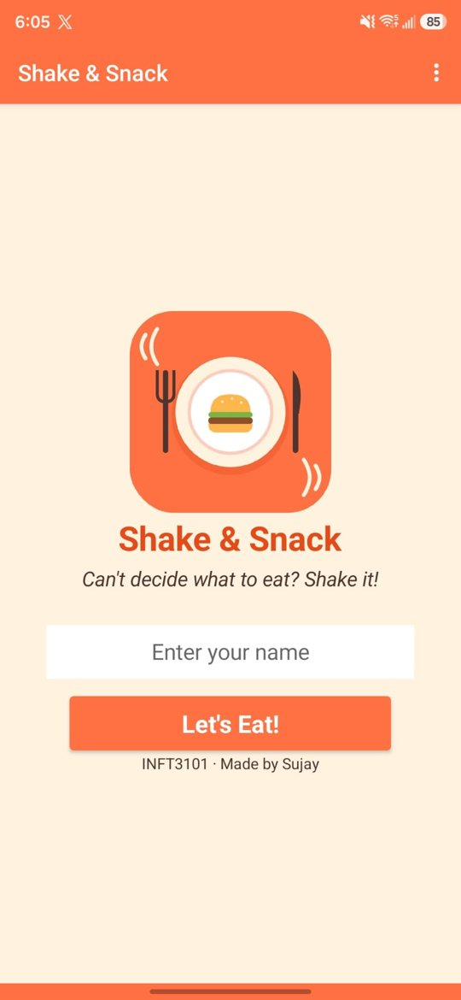
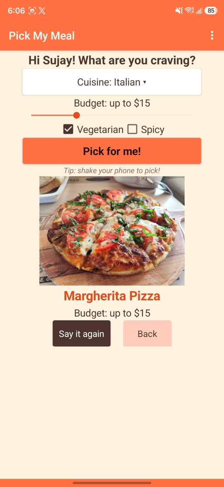
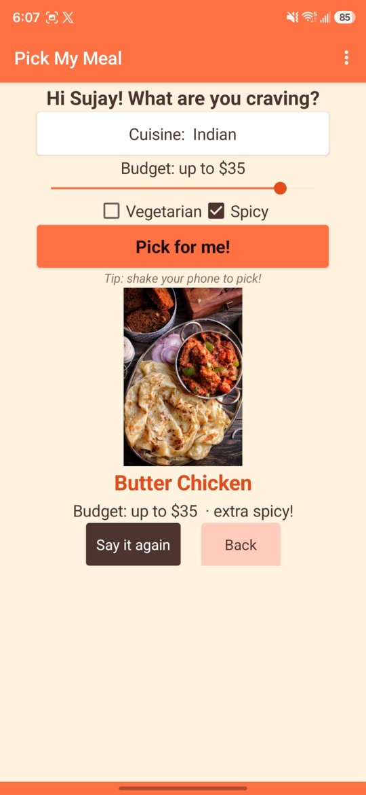
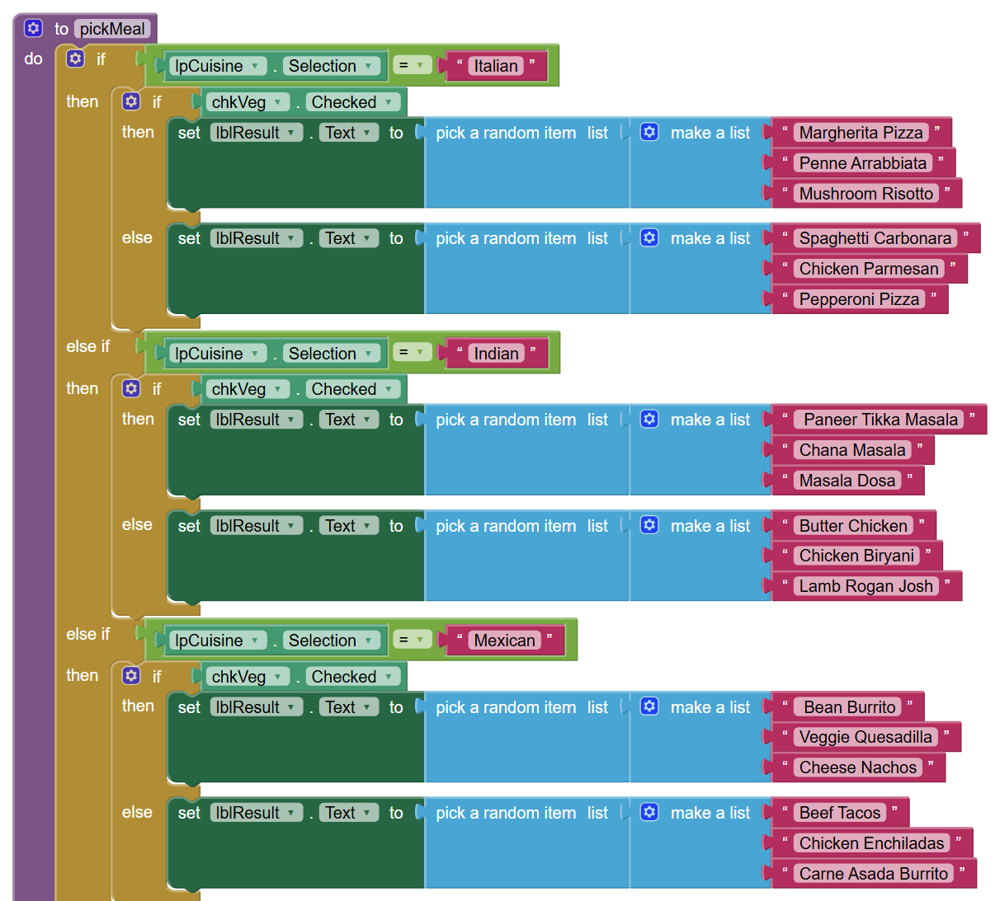
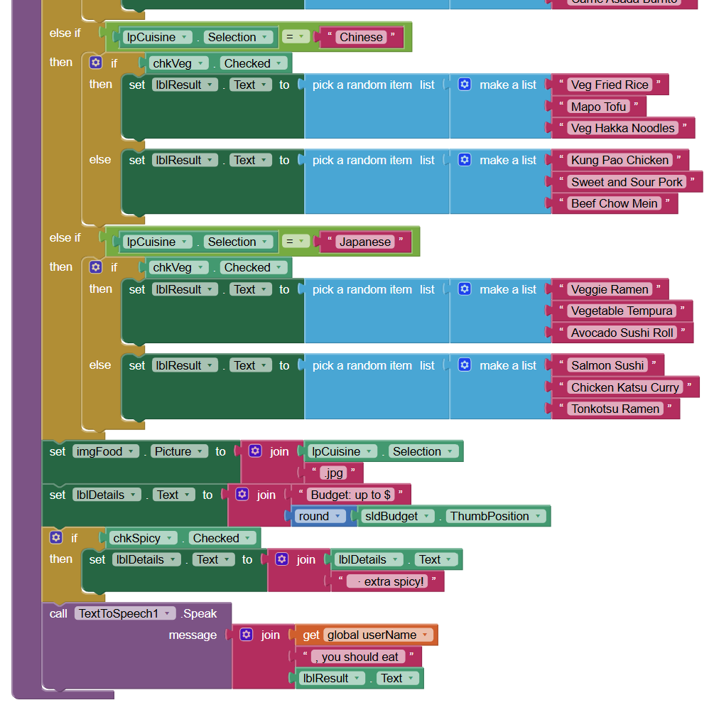

# Shake & Snack 🍔

A two-screen Android app that helps people decide what to eat. Choose a cuisine, set a budget and diet options, then **tap a button or shake your phone**. The app picks a meal for you, shows a photo and reads the result out loud.

Built with **MIT App Inventor** for INFT3101 (App Development) at Durham College, September 2026.

  
  
  

## Features

- **Personalized greeting:** the user's name is passed from the welcome screen to the picker screen and used in the spoken result
- **Filters:** 5 cuisines (Italian, Indian, Mexican, Chinese, Japanese), vegetarian and spicy options, and a $5 to $40 budget slider
- **Shake to pick:** the accelerometer triggers the same `pickMeal` procedure as the button, so the logic is written once
- **Text-to-speech:** reads the result aloud, with a "Say it again" button
- **Input validation:** alerts the user if the name box is empty
- **Custom theme:** hand-set food-themed colours so the app looks the same in light and dark mode

## How it works

The core logic sits in one procedure, `pickMeal`:

1. Check which cuisine was selected
2. Use the Vegetarian checkbox to choose between a vegetarian and a non-vegetarian meal list
3. Pick a random meal from that list
4. Show the cuisine photo and budget, add "extra spicy!" if Spicy is ticked, and speak the result

| Component | Used for |
|---|---|
| TextBox | User's name |
| ListPicker | Cuisine dropdown |
| Slider | Budget ($5 to $40) |
| CheckBox ×2 | Vegetarian, Spicy |
| Button ×4 | Start, Pick, Speak, Back |
| Image ×2 | Logo, cuisine photo |
| AccelerometerSensor | Shake to pick |
| TextToSpeech | Reads the result aloud |
| Notifier | Empty-name alert |

### Block code

## Testing

Tested on a Samsung Galaxy S25 Ultra (Android 16) using the installed `.apk`, and live with the MIT AI2 Companion during development.

| # | Test | Expected result | Result |
|---|---|---|---|
| 1 | Tap Let's Eat! with an empty name | Alert is shown | ✅ Pass |
| 2 | Enter name and tap Let's Eat! | PickerScreen opens with greeting | ✅ Pass |
| 3 | Move the slider | Budget label updates | ✅ Pass |
| 4 | Choose a cuisine | Button shows "Cuisine: …" | ✅ Pass |
| 5 | Italian + Vegetarian, tap Pick for me! | Vegetarian Italian meal, photo and speech | ✅ Pass |
| 6 | Indian + Spicy, tap Pick for me! | Non-veg Indian meal with "extra spicy!" | ✅ Pass |
| 7 | Shake the phone | A new meal is picked | ✅ Pass |
| 8 | Tap Say it again | Last result is spoken again | ✅ Pass |
| 9 | Tap Back | Returns to Screen1 | ✅ Pass |

### Bugs found and fixed

- **Start button did nothing:** Screen1 had no click event yet. Added `btnStart.Click`.
- **Results only worked for Japanese food:** the photo, budget and speech blocks had snapped inside the Japanese branch. Moved them below the `if` block.
- **Text hard to read in dark mode:** set every colour by hand.

## Run it yourself

1. Download the `.aia` file from this repo
2. Go to [ai2.appinventor.mit.edu](https://ai2.appinventor.mit.edu) and sign in
3. Choose **Projects → Import project (.aia) from my computer**
4. Test it with the MIT AI2 Companion app, or build an `.apk`

## What I'd add next

- A photo for each meal instead of each cuisine
- Saving favourite meals with TinyDB
- Nearby restaurant suggestions using the location sensor

## Full report

The full project report covers design, blocks, testing and reflection: [Shake-and-Snack-Report.pdf](Shake-and-Snack-Report.pdf)

---

**Sujay Tailor**, Durham College
